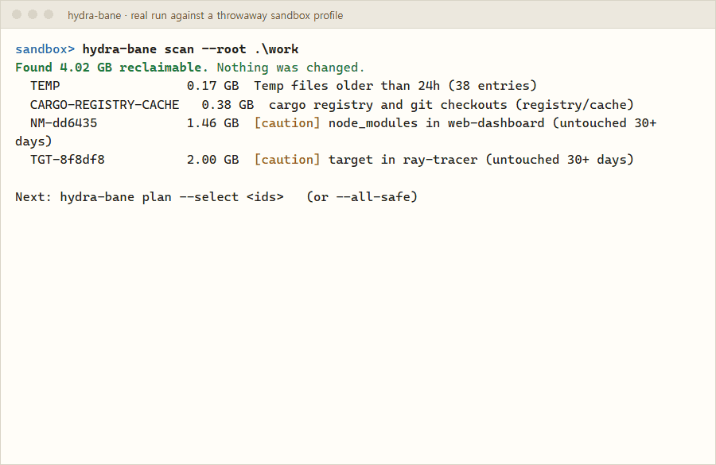

# Hydra-bane

**English** · [한국어](README.ko.md)

**Let your AI agent clean up Windows. Nothing changes until you approve, and what it moves can be put back.**

A disk cleanup CLI and Claude Code plugin for Windows 10/11. Your agent scans, drafts a sealed plan, shows you exactly what it will touch, and waits for your yes. Every change leaves a receipt.

[](https://www.npmjs.com/package/hydra-bane)
[)](https://github.com/hydra-bane/hydra-bane/actions/workflows/ci.yml)
[](https://github.com/hydra-bane/hydra-bane/blob/main/LICENSE)




<sub>A real, unedited run against a throwaway sandbox profile (no real files involved). Recorded with <code>scripts/demo/</code>.</sub>

> [!NOTE]
> **v0.2** adds the [Atlas](#the-atlas-unwanted-programs-by-country) (bundled and hard-to-remove software, by country), admin cleanup, ten more developer and AI caches, an MCP server with read-only tools, and hard-link-aware sizes. Threat evidence checks are still on the [roadmap](#roadmap).

## Quick start

Requires Windows 10/11 and Node.js 22.18 or newer. No admin rights needed to scan.

```powershell
npx hydra-bane scan        # read-only: shows what could be reclaimed, changes nothing
```

**Claude Code plugin** (skill, MCP server and approval hook). Send these as two separate prompts:

```
/plugin marketplace add hydra-bane/hydra-bane
```
```
/plugin install hydra-bane@hydra-bane
```

Then ask: *"Free up some disk space with hydra-bane."* Other agents: see [Works with](#works-with).

## What a scan looks like

Real output from a developer PC (v0.1):

```
> hydra-bane scan
Found 9.82 GB reclaimable. Nothing was changed.
  TEMP                 0.27 GB  Temp files older than 24h (477 entries)
  NPM                  0.35 GB  npm cache
  PNPM                 0.49 GB  pnpm store (prune removes unreferenced packages: up to this size)
  UV                   7.82 GB  uv cache (prune removes unused entries: up to this size)
  BROWSER-CHROME       0.73 GB  Chrome cache (cookies, logins and history are not touched)
  SHADER-NVIDIA-DX     0.09 GB  GPU shader cache NVIDIA\DXCache (rebuilt by games; first launch may stutter)
  DUMPS                0.05 GB  Application crash dumps (10 file(s); keep them if a developer asked for them)

Next: hydra-bane plan --select <ids>   (or --all-safe)
```

And the approval you see before anything runs, even in Claude Code's bypass-permissions mode:

```
Hydra-bane will apply plan mui6uyrt780161d8 (8b6e44b8):
- PIP 70 MB: runs "pip cache purge" on c:\users\you\appdata\local\pip\cache (re-downloadable, not undoable)
```

## How it works

```
scan  ->  plan  ->  you approve  ->  apply  ->  receipt  ->  undo (7 days)
```

1. **`scan`** finds candidates and changes nothing.
2. **`plan --select TEMP,NPM`** seals your choice: hashed, bound to your user and PC, valid for 24 hours. It cannot grow after you read it.
3. **`apply <plan-id>`** refuses to run without confirmation. Your agent shows you the plan and asks; in a terminal you get a y/N prompt. Scripts must pass `--yes`.
4. Each change is written to a hash-chained receipt ledger **before** it happens.
5. **`undo <tx>`** puts quarantined items back. After 7 days, old quarantine shows up in `scan` as `Q-…` so you can choose to empty it. Nothing is purged automatically.

## What it cleans

| Target | What happens | Can you get it back? |
|---|---|---|
| Temp files older than 24h | Moved to quarantine | Yes, `undo` for 7 days |
| Application crash dumps | Moved to quarantine | Yes, `undo` for 7 days |
| `node_modules` / Rust `target` untouched 30+ days and git-ignored, under `~/source`, `~/dev`, `~/projects`, `~/repos` or any `--root <dir>` | Moved to quarantine | Yes, `undo` for 7 days |
| npm, pnpm, pip, uv, yarn, bun, conda, poetry, Go and NuGet caches | The tool's own clean command (for example `npm cache clean --force`, `go clean -cache`, `dotnet nuget locals … --clear`) | Re-downloaded when needed |
| Cargo registry, old Gradle versions, stale Maven artifacts, Hugging Face models | Deleted | Re-downloaded when needed |
| Ollama models | `ollama rm <model>`; layers shared with other models stay | `ollama pull` |
| Chrome, Edge, Brave, Firefox caches | Only the cache folders are deleted. Refused while the browser is running | Rebuilt by the browser |
| GPU shader caches | Deleted | Rebuilt by games |
| Admin items: Windows Update downloads, Delivery Optimization cache, old system Temp files, memory dumps, superseded components (DISM), hibernation file | Skipped by `apply`; `apply-admin` runs them through an admin-only helper after a UAC prompt | No, permanent |
| WSL disks | `wsl --manage <distro> --set-sparse true`, so the disk gives space back by itself | Turn it off again with the same command |
| `Windows.old`, Docker Desktop disk | Reported only, with the official way to remove them | n/a |

Sizes count each hard-linked file once, so pnpm stores and similar caches are not inflated. Not sure about an item? `hydra-bane explain <id>` says why it is safe and what happens afterwards.

## The Atlas: unwanted programs by country

The [Atlas](https://github.com/hydra-bane/atlas) is a community-maintained, per-country catalog of bundled and hard-to-remove software (data under CC BY-SA 4.0). It starts with seven entries from Korea and the US, each backed by public sources such as KISA advisories, the FTC and security research. `hydra-bane atlas update` downloads the signed catalog; after that, `scan` lists installed programs that match an entry.

The Atlas states facts, not verdicts. For each match you see:

- **What it is**, in one neutral sentence with its source.
- **What it does on your PC, measured during the scan** (read-only): trusted root certificates it installed, ports it listens on and whether other machines can connect, and services that start with Windows.
- **Third-party advisories (KISA, NVD, CISA…) quoted with date and link**, and marked as covering your version only when their version range includes it. Advisories for older versions say that your version is newer.

Hydra-bane does not judge the program. You decide whether to keep it.

- **Removal runs the vendor's own uninstaller, never a command line from the registry as-is.** The uninstaller must be the file the entry names, signed by a certificate the entry pins, and its arguments must stay inside the program's folder. Anything else is refused.
- **When the uninstaller cannot be verified, Hydra-bane only reports** what it found and points you to Settings > Apps.

Found something the Atlas doesn't know? When you ask your agent to get rid of it, Hydra-bane offers to report it. You see exactly what would be posted first: name, publisher, code signer, file hash and `%VAR%`-relative paths. It never includes your user name, PC name or real paths, and nothing is sent unless you say yes. A bot collects reports into one candidate pull request per program for maintainers to review.

### Uninstall any program

You don't need the Atlas to remove a program. `hydra-bane uninstall <program-id>` (ids from `programs`) seals a one-item plan that runs the program's own uninstaller, and `apply` runs it after you approve. The registry entry is data, never a command: Hydra-bane runs the uninstaller only if it is a Windows Installer product (Hydra-bane builds `msiexec /x {product code}` itself), carries a valid signature from the program's own publisher, or is installed for all users in a folder only administrators can change. Shells, script hosts and arguments pointing outside the program's folder are refused, and everything is checked again right before it runs. The approval prompt shows the exact command line. Otherwise you get the Settings > Apps steps instead.

After an uninstall, `hydra-bane scan --only leftovers` finds what that program left behind: folders named exactly after it in AppData, shortcuts that now point nowhere, and its keys under `HKCU\Software`. Folders go to quarantine and registry keys are exported before deletion, so `undo` brings both back. Folders holding your documents or a git repository, and machine-wide folders, are only reported. Hydra-bane looks only at programs it removed itself; it does not guess across all of AppData.

## Why not just let my agent `rm -rf`?

Your agent can already delete files. The problem is that nobody knows what it deleted until it is gone.

| | Agent improvising cleanup | Hydra-bane |
|---|---|---|
| What gets touched | Whatever the composed command matches | A list with sizes that you read first |
| Scope creep | The next command can reach further | The plan is sealed; a change means a new plan |
| Who says yes | The agent, especially in auto-approve mode | You, through a prompt that names every item |
| Mistakes | Permanent | User files are quarantined, not deleted |
| Record | Scrollback, if you kept it | A tamper-evident receipt per change |

## How it compares

Hydra-bane is not the first cleanup tool for Windows, and it does not try to replace these. Each cell below comes from the project's own README or docs, checked on 2026-09-26. "—" means we found nothing about it in their docs.

| | Hydra-bane | [Mole](https://github.com/tw93/Mole/tree/windows) (Windows branch) | [BleachBit](https://www.bleachbit.org/) | [winutil](https://github.com/ChrisTitusTech/winutil) | [Bulk Crap Uninstaller](https://github.com/BCUninstaller/Bulk-Crap-Uninstaller) | Agent + shell |
|---|---|---|---|---|---|---|
| Main job | Disk cleanup and unwanted-program removal, driven by an agent | Clean and optimize Windows, uninstall apps | Free disk space, privacy cleaning | Install apps, tweaks and debloat, Windows Update settings | Remove many programs at once | Anything |
| Made for AI agents (JSON output, plugin, MCP) | Yes | No | No | No | No (XML export only) | n/a |
| Preview before changes | `scan` and `plan` are read-only | `--dry-run` for clean and optimize; uninstall asks y/N | Preview (GUI and `--preview`) | — | Confirmation, leftover list, optional simulation | Only if the agent chooses to |
| Undo | Quarantine + `undo` for 7 days (caches are re-downloaded instead) | No: deletion is permanent | No | "Undo Selected Tweaks"; optional restore point | Optional restore point; leftovers go to the Recycle Bin | Not built in |
| Leftovers after uninstall | Yes, for programs it removed: exact-name folders, dead shortcuts and user registry keys, all undoable | Yes | n/a (not an uninstaller) | — | Yes, each rated by confidence | Whatever the agent writes |
| Per-country bundled-software catalog | Atlas (CC BY-SA 4.0) | — | — | — | — | No |
| Status | Early (v0.2) | "Experimental", prerelease builds | Stable (6.0.4, Sept 2026) | Active (release 26.08.19) | Active (6.3, Sept 2026) | n/a |
| License | Apache-2.0 | MIT (Windows branch) | GPL-3.0+ | MIT | Apache-2.0 | n/a |

Mole is excellent on macOS; if you are on a Mac, use it. Hydra-bane borrows its command layout and is not a port. BleachBit, winutil and BCU are mature tools that each do their own job far more broadly than Hydra-bane does today. What Hydra-bane adds is the part an AI agent needs: a sealed plan, a human yes, receipts and undo. Spotted an error in this table? Please open an issue.

## Safety model

- **Path guard.** Drive roots, your profile and known folders (Desktop, Documents, OneDrive…) are refused, and so is any folder that contains them. Paths through `.git`, `.ssh` or `.gnupg` are refused too. Ambiguous paths (`/c/…`, `..`, UNC, 8.3 short names, alternate data streams) and junction redirects are rejected. Tested with 10,000 randomized paths.
- **Quarantine, not delete.** Items are moved whole on the same volume into a folder with inheritance cut off and execution denied. Restores never overwrite, and tampering is detected with SHA-256 (files up to 256 MB).
- **Approval hook.** The Claude Code plugin makes Claude Code ask you before any `hydra-bane apply` or `undo`, and the prompt lists what will happen. It also blocks recursive deletes of drives and profiles from any command. Verified in bypass-permissions mode on Claude Code 2.1.283.
- **MCP tools cannot change your PC.** The MCP server can scan, explain, analyze, draft a sealed plan (a file in Hydra-bane's own folder) and verify receipts. It has no apply or undo tool; applying stays with you.
- **Admin work runs from an admin-only folder.** Elevated steps run from a helper copied into a folder only administrators can write, after its hash is checked against the npm registry. The UAC prompt shows the plan hash, and the helper checks the plan again instead of trusting the caller.
- **Receipts.** A hash-chained ledger that shows edits, deletions and reordering. `hydra-bane ledger` verifies it.

### Limitations

- Without the Claude Code plugin's hook, an agent in auto-approve mode could pass `--yes` itself. Keep approvals on for `hydra-bane apply`.
- Caches emptied by their own tools, uninstalled programs and purged quarantine cannot be undone.
- pnpm, uv and conda sizes are upper bounds; their prune commands usually free less.
- Antivirus software may remove files from quarantine. `undo` reports these as `STORED_MISSING`.
- Admin items and the admin-only helper are new in v0.2 and were tested with simulated elevation, not yet on many real PCs.
- The first Atlas scan checks code signatures and takes about 30 seconds; later scans reuse the results.
- It is not an antivirus and does not claim to find malware.

## Works with

| Host | How | Status |
|---|---|---|
| Claude Code | Plugin: skill, MCP server, approval hook | Tested |
| Codex CLI | [`AGENTS.md`](AGENTS.md) + CLI with `--json` | Tested (read-only scan, Codex CLI 0.154, 2026-09-26) |
| Gemini CLI | [`AGENTS.md`](AGENTS.md) + CLI with `--json` | Best effort |
| Cursor and other MCP hosts | MCP server: `npx -y hydra-bane mcp` | Best effort |
| Plain terminal | `npx hydra-bane …` with a y/N prompt | Tested |

Every command accepts `--json` and returns `{schema_version, command, ok, data, warnings, error?, hints?}`. Item IDs are stable across runs (`TEMP`, `NPM`, `NM-3f2a1c`…). Exit codes: `0` ok, `1` error, `2` refused by the guard, `3` needs human confirmation, `4` partial success. Agents must never pass `--yes` without an explicit approval from the user in the conversation; [`AGENTS.md`](AGENTS.md) has the full rules.

## Commands

| Command | Does | Changes anything? |
|---|---|---|
| `scan [--only <categories>] [--root <dir>]` | Find reclaimable space | No |
| `plan --select <ids>` / `--all-safe` | Seal a plan | No (writes a plan file) |
| `apply <plan-id> [--yes]` | Apply after confirmation | Yes |
| `undo <tx> [--yes]` | Restore a transaction | Yes |
| `explain <id>` | Why an item is safe to clean | No |
| `analyze [dir]` | Browse what uses space (arrow keys) | No |
| `ledger` | Verify and list receipts | No |
| `programs` | List installed programs | No |
| `uninstall <program-id>` | Seal a plan that runs the program's own uninstaller after the checks above | No (writes a plan file) |
| `report <program-id>` | Preview an Atlas report of an unwanted program; `--submit` posts it after you approve | Only with `--submit` |
| `atlas update` / `atlas status` | Download and verify the signed Atlas catalog, or show the installed one | Downloads the catalog |
| `apply-admin <plan-id>` | Run a plan's administrator items (UAC prompt) | Yes |
| `admin-install` | Install the admin-only helper, verified against npm (UAC prompt) | Yes |
| `recover` | Finish the receipts of an interrupted apply or undo | Receipts only |
| `mcp` | Run the read-only MCP server on stdio | No |
| `status [--watch]` | CPU, memory, disks, GPU, network, battery, top processes and a health score with its reasons | No |
| `optimize` | List maintenance actions: DNS flush and icon refresh run through a plan; Store/thumbnail/search/Recycle Bin/startup are explained, not run | Only the two run through `apply` |
| `scan --only installers,orphans` | Old installers in Downloads, app folders nothing references, dead Start Menu shortcuts | No (apply quarantines, undoable) |

## Roadmap

- **v0.3**: threat evidence checks (autorun locations, signatures, YARA and hash matching; Defender as a second opinion, never changed), more Atlas countries (China, Russia, Brazil, Japan), orphaned drivers left behind by games.
- Later: a stable JSON API 1.0 and a published external security audit.

## Support

If Hydra-bane saved you some disk space or a bad afternoon, a star helps other Windows users find it. The most useful contribution is an Atlas entry for your country: the software that came bundled on your PC and wouldn't leave.

## License

Code: [Apache-2.0](https://github.com/hydra-bane/hydra-bane/blob/main/LICENSE). Atlas data: CC BY-SA 4.0. Name use: [TRADEMARK.md](https://github.com/hydra-bane/hydra-bane/blob/main/TRADEMARK.md). Security issues: [SECURITY.md](https://github.com/hydra-bane/hydra-bane/blob/main/SECURITY.md).
Inspired by [Mole](https://github.com/tw93/Mole) for macOS; not affiliated with it.
